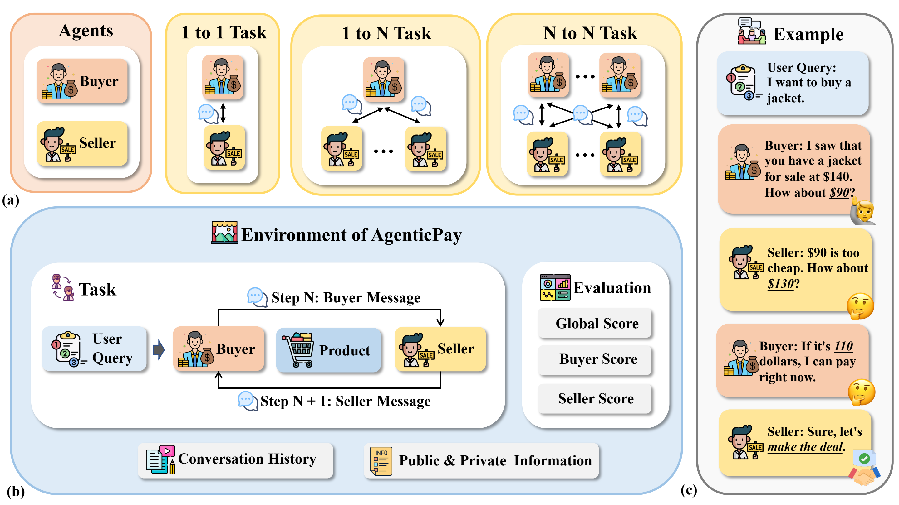
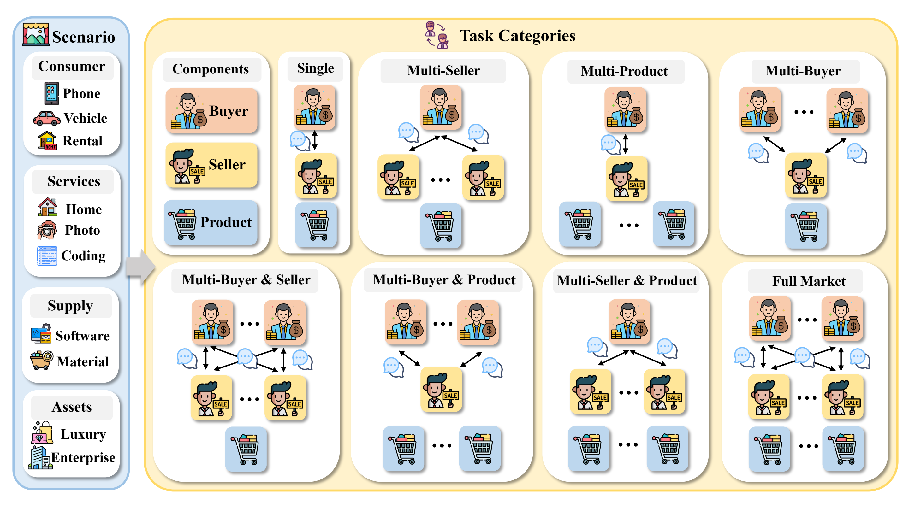

<h1 align="center" style="font-size: 30px;"><strong><em>AgenticPay</em></strong>: A Multi-Agent LLM Negotiation System for Buyer–Seller Transactions</h1>
<p align="center">
    <a href="https://arxiv.org/pdf/2602.06008">Paper</a>
    ·
    <a href="https://github.com/SafeRL-Lab/AgenticPay">Code</a>
    ·
    <a href="https://agenticpay-tutorial.readthedocs.io/en/latest/">Tutorial</a>
    ·
    <a href="https://github.com/SafeRL-Lab/AgenticPay/issues">Issue</a>
  </p>
</div>

---



*Figure 1: AgenticPay Framework Overview*


*Figure 2: Senario and Task Categories*

- [Overview](#overview)
- [Features](#features)
- [Installation](#installation)
- [Quick Start](#quick-start)
  * [Running the Example Script](#running-the-example-script)
  * [Basic Single-Product Negotiation](#basic-single-product-negotiation)
- [Project Structure](#project-structure)
- [Core Components](#core-components)
  * [Environments](#environments)
  * [Agents](#agents)
  * [Environment Registration System](#environment-registration-system)
  * [ConversationMemory](#conversationmemory)
- [Configuration](#configuration)
  * [Environment Parameters](#environment-parameters)
  * [Agent Configuration](#agent-configuration)
  * [User Profile](#user-profile)
  * [LLM Configuration](#llm-configuration)
- [Examples](#examples)
  * [Available Examples](#available-examples)
  * [Registering New Environments](#registering-new-environments)
  * [Adding New Features](#adding-new-features)
- [License](#license)
- [Contributing](#contributing)
- [Citation](#citation)


## Overview

AgenticPay is a framework for simulating multi-agent negotiations between buyers and sellers. It uses Large Language Models (LLMs) as the foundation for intelligent agents that can engage in realistic price negotiations. The framework is designed with a Gymnasium-like API for easy integration and extensibility.

## Features

- 🤖 **LLM-based Agents**: Buyer and Seller agents powered by LLMs (currently supports OpenAI, vLLM, and SGLang)
- 💬 **Multi-turn Conversations**: Support for extended negotiation dialogues
- 🧠 **Memory System**: Conversation history management for context-aware negotiations
- 📊 **State Tracking**: Comprehensive tracking of prices, rounds, and negotiation status
- 🎯 **Flexible Configuration**: Customizable negotiation parameters and agent behaviors
- 🔌 **Extensible Design**: Easy to add new agent types or LLM providers
- 🏪 **Environment Registration System**: Gymnasium-like environment registration for easy environment management
- 🛍️ **Multi-Product Negotiations**: Support for negotiating multiple products with context preservation
- 👥 **Multi-Agent Scenarios**: Support for multiple buyers, sellers, and products in various combinations
- 🔄 **Parallel & Sequential Negotiations**: Support for both parallel and sequential negotiation modes
- 👤 **User Profiles**: Personal preference system that influences agent negotiation behavior

## Installation

```bash
# Create conda environment
conda create -n agenticpay python=3.10 -y
conda activate agenticpay

# Navigate to project directory
cd AgenticPay

# Install dependencies
pip install -r requirements.txt

# Install package in editable mode
pip install -e .
```

**Model Download**: Download models from Hugging Face and save them to the `agenticpay/models/download_models` directory for local model usage.

## Quick Start

### Running the Example Script

To quickly try a negotiation simulation, you can run the provided example script from the command line:

```bash
python agenticpay/examples/single_buyer_product_seller/Task1_basic_price_negotiation.py
```

This script runs a simple negotiation task between a buyer and a seller.

### Basic Single-Product Negotiation

```python
from agenticpay import make  # Recommended: use registration system
from agenticpay.agents.buyer_agent import BuyerAgent
from agenticpay.agents.seller_agent import SellerAgent
import os


# Local models (SGLang, vLLM, etc.)
from agenticpay.models.sglang_lm import SGLangLM
from agenticpay.models.vllm_lm import VLLMLM

model_path = "agenticpay/models/download_models/Qwen3-8B-Instruct"

# Option 1: SGLang LM
model = SGLangLM(model_path=model_path)

# Option 2: vLLM LM (for multi-GPU setups)
# model = VLLMLM(
#     model_path=model_path,
#     trust_remote_code=True,
#     gpu_memory_utilization=0.9,
#     tensor_parallel_size=4,  # Number of GPUs
# )

# Create agents with bottom prices (confidential)
buyer_max_price = 120.0  # Maximum acceptable price for buyer
seller_min_price = 80.0   # Minimum acceptable price for seller

buyer = BuyerAgent(model=model, buyer_max_price=buyer_max_price)
seller = SellerAgent(model=model, seller_min_price=seller_min_price)

# Configure reward weights (optional)
reward_weights = {
    "buyer_savings": 1.0,      # Buyer savings weight
    "seller_profit": 1.0,      # Seller profit weight
    "time_cost": 0.1,          # Time cost weight
}

# Create environment using registration system (recommended)
env = make(
    "Task1_basic_price_negotiation-v0",
    buyer_agent=buyer,
    seller_agent=seller,
    max_rounds=20,
    initial_seller_price=150.0,
    buyer_max_price=buyer_max_price,
    seller_min_price=seller_min_price,
    environment_info={
        "temperature": "warm",
        "season": "summer",
        "weather": "sunny",
    },
    price_tolerance=0.0,
    reward_weights=reward_weights,  # Optional: reward weights configuration
)

# User profile (optional text description of personal preferences)
user_profile = "User prefers business/professional style and likes to compare prices before making purchases. In negotiations, they may mention comparing other options and seek better deals."

# Reset and start negotiation
observation, info = env.reset(
    user_requirement="I need a high-quality winter jacket",
    product_info={
        "name": "Premium Winter Jacket",
        "brand": "Mountain Gear",
        "price": 180.0,
        "features": ["Waterproof", "Insulated", "Windproof", "Breathable"],
        "condition": "New",
        "material": "Gore-Tex",
    },
    user_profile=user_profile,  # Optional
)

# Run negotiation loop
done = False
while not done:
    # Buyer responds first
    buyer_action = buyer.respond(
        conversation_history=observation["conversation_history"],
        current_state=observation
    )
    
    # Update conversation history with buyer's response
    updated_conversation_history = observation["conversation_history"].copy()
    if buyer_action:
        current_round = observation.get("current_round", 0)
        updated_conversation_history.append({
            "role": "buyer",
            "content": buyer_action,
            "round": current_round
        })
    
    # Seller responds (can see buyer's message)
    seller_action = seller.respond(
        conversation_history=updated_conversation_history,
        current_state=observation
    )
    
    # Execute step with both actions
    observation, reward, terminated, truncated, info = env.step(
        buyer_action=buyer_action,
        seller_action=seller_action
    )
    done = terminated or truncated
    env.render()

print(f"Negotiation ended: {info['status']}")
print(f"Final price: ${info.get('seller_price', 'N/A')}")
env.close()
```

## Project Structure

```
AgenticPay/
├── agenticpay/
│   ├── agents/                    # Agent implementations (buyer, seller)
│   ├── envs/                      # Environment implementations
│   │   ├── single_buyer_product_seller/  # Basic negotiation
│   │   ├── only_multi_products/   # Multi-product scenarios
│   │   ├── only_multi_seller/     # Multi-seller scenarios
│   │   ├── only_multi_buyer/      # Multi-buyer scenarios
│   │   └── multi_*/               # Complex multi-agent scenarios
│   ├── models/                    # LLM implementations (supports vLLM, SGLang, OpenAI API)
│   ├── memory/                    # Conversation history management
│   ├── utils/                     # Utilities (state, user profile)
│   └── examples/                   # Example scripts organized by scenario
├── README.md
├── setup.py
└── requirements.txt
```

## Core Components

### Environments

The framework provides a comprehensive set of negotiation environments organized by complexity:

#### Single Buyer + Product + Seller (`single_buyer_product_seller/`)

Basic negotiation scenarios with one buyer, one product, and one seller.

- **Task1: Basic Price Negotiation** - Fundamental price negotiation environment
- **Task2: Close Price Negotiation** - Tests edge cases with narrow price ranges
- **Task3: Close to Market Price Negotiation** - Tests scenarios near market price

#### Only Multi-Products (`only_multi_products/`)

Environments for negotiating multiple products with a single buyer and seller.

- **Task1: Multi-Product Negotiation** - General multi-product negotiation
- **Task2: Two Product Negotiation** - Two products negotiation
- **Task3: Five Product Negotiation** - Five products negotiation
- **Task4: Select Three from Five Negotiation** - Product selection and negotiation

#### Only Multi-Seller (`only_multi_seller/`)

Environments with multiple sellers competing for a single buyer.

- **Task1-2: Parallel Multi-Seller** - Parallel negotiations with multiple sellers
- **Task3-4: Sequential Multi-Seller** - Sequential negotiations with multiple sellers

#### Only Multi-Buyer (`only_multi_buyer/`)

Environments with multiple buyers competing for products.

- **Task1-2: Parallel Multi-Buyer** - Parallel negotiations with multiple buyers
- **Task3-4: Sequential Multi-Buyer** - Sequential negotiations with multiple buyers

#### Multi-Buyer Multi-Seller (`multi_buyer_multi_seller/`)

Complex environments with multiple buyers and multiple sellers.

#### Multi-Products Multi-Seller (`multi_products_multi_seller/`)

Environments with multiple products and multiple sellers.

#### Multi-Buyer Multi-Products (`multi_buyer_multi_products/`)

Environments with multiple buyers and multiple products.

#### Multi-Buyer Multi-Products Multi-Seller (`multi_buyer_multi_products_multi_seller/`)

Most complex environments with multiple buyers, products, and sellers.

**Common Environment Methods:**
- `reset()`: Initialize a new negotiation
- `step()`: Execute one negotiation turn (accepts agent actions)
- `render()`: Display current negotiation state
- `close()`: Close environment and clean up

### Agents

#### BaseAgent

Abstract base class for all agents.

**Subclasses:**
- `BuyerAgent`: Represents the buyer, negotiates based on user requirements and budget
- `SellerAgent`: Represents the seller, negotiates based on product information and market conditions

### Environment Registration System

Gymnasium-like environment registration system for easy environment management.

**Key Functions:**
- `make()`: Create environment instance by ID
- `register()`: Register new environment
- `spec()`: Get environment specification
- `pprint_registry()`: List all registered environments

**Usage:**
```python
from agenticpay import make

# Single buyer/product/seller
env = make("Task1_basic_price_negotiation-v0", buyer_agent=buyer, seller_agent=seller, max_rounds=20)

# Multi-product
env = make("Task1_multi_product_negotiation-v0", buyer_agent=buyer, seller_agent=seller, max_rounds_per_product=20)

# Multi-seller
env = make("Task1_parallel_two_seller_negotiation-v0", buyer_agent=buyer, seller_agents=[seller1, seller2], max_rounds=20)
```

### ConversationMemory

Manages conversation history and context.

**Features:**
- Message storage with metadata
- History retrieval (full or recent)
- Role-based filtering

## Configuration

### Environment Parameters

Common parameters across environments:
- `max_rounds`: Maximum number of negotiation rounds
- `initial_seller_price`: Starting price from seller
- `buyer_max_price`: Maximum acceptable price for buyer (confidential)
- `seller_min_price`: Minimum acceptable price for seller (confidential)
- `price_tolerance`: Price difference threshold for agreement
- `environment_info`: Contextual information (weather, season, etc.)
- `reward_weights`: Dictionary controlling the relative importance of different reward components
  - `buyer_savings`: Weight for buyer savings (difference between max price and agreed price)
  - `seller_profit`: Weight for seller profit (difference between agreed price and min price)
  - `time_cost`: Weight for time cost (penalty for negotiation rounds)

### Agent Configuration

- **BuyerAgent**: `buyer_max_price` (maximum acceptable purchase price)
- **SellerAgent**: `seller_min_price` (minimum acceptable selling price)

### User Profile

User description is passed as a string to agents during negotiation initialization.

### LLM Configuration

Supports multiple providers:
- **Local Models**: `SGLangLM`, `VLLMLM` - for local model inference (supports multi-GPU setups)
- **OpenAI** (API): `OpenAILLM` - requires API key
- **HuggingFace** (local/online): `HuggingFaceLLM` - requires model name and device

## Examples

### Available Examples

Examples are organized by environment category:

1. **Single Buyer + Product + Seller** (`examples/single_buyer_product_seller/`)
   - `Task1_basic_price_negotiation.py` - Basic price negotiation
   - `Task2_close_price_negotiation.py` - Close price negotiation
   - `Task3_close_to_market_price_negotiation.py` - Market price negotiation
   - `registration_example.py` - Registration system demonstration

2. **Multi-Product Negotiations** (`examples/only_multi_products/`)
   - Multiple products negotiation examples
   - Product selection scenarios

3. **Multi-Seller Negotiations** (`examples/only_multi_seller/`)
   - Parallel and sequential multi-seller scenarios

4. **Multi-Buyer Negotiations** (`examples/only_multi_buyer/`)
   - Parallel and sequential multi-buyer scenarios

5. **Complex Multi-Agent Scenarios**
   - `examples/multi_buyer_multi_seller/` - Multiple buyers and sellers
   - `examples/multi_products_multi_seller/` - Multiple products and sellers
   - `examples/multi_buyer_multi_products/` - Multiple buyers and products
   - `examples/multi_buyer_multi_products_multi_seller/` - Full multi-agent scenarios

### Registering New Environments

1. Create a new environment class inheriting from `BaseEnv`
2. Implement `reset()` and `step()` methods
3. Register using the registration system

Example:
```python
from agenticpay.core import BaseEnv
from agenticpay.envs import register

class MyCustomEnv(BaseEnv):
    def reset(self, **kwargs):
        # Implementation
        return observation, info
    
    def step(self, action):
        # Implementation
        return observation, reward, terminated, truncated, info

# Register environment
register(
    id="MyCustomEnv-v0",
    entry_point="agenticpay.envs.my_custom_env:MyCustomEnv",
    max_episode_steps=100,
)
```

### Adding New Features

The framework is designed to be extensible. Key extension points:
- Custom reward functions
- Advanced price extraction
- Custom negotiation strategies
- Learning-based agent behaviors
- Additional agent types
- Custom memory systems

For detailed guides, see:
- `ENV_REGISTRATION.md` - Environment registration system
- `PROJECT_STRUCTURE.md` - Project structure and extension points
- `QUICKSTART.md` - Quick start guide

## License

MIT License

## Contributing

Contributions are welcome! Please feel free to submit issues or pull requests.

## Citation

If you use AgenticPay in your research, please cite:

```bibtex
@misc{agenticpay2025,
    title={AgenticPay: A Multi-Agent LLM Negotiation System for Buyer–Seller Transactions},
    author={Xianyang Liu, Shangding Gu, Dawn Song},
    year = {2025},
    publisher = {GitHub},
    journal = {GitHub repository},
    howpublished = {\url{https://github.com/SafeRL-Lab/AgenticPay}},
}
```
